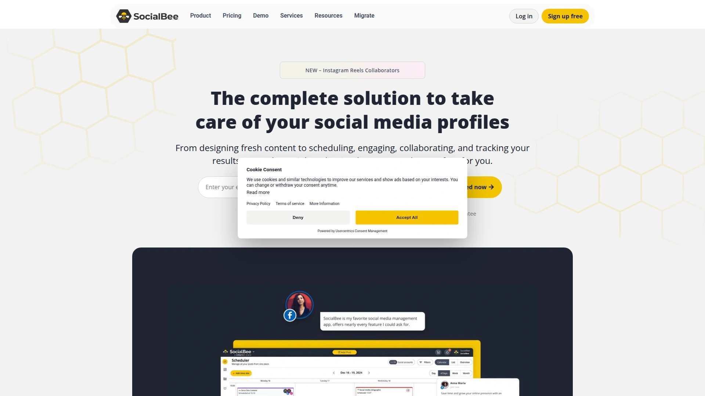
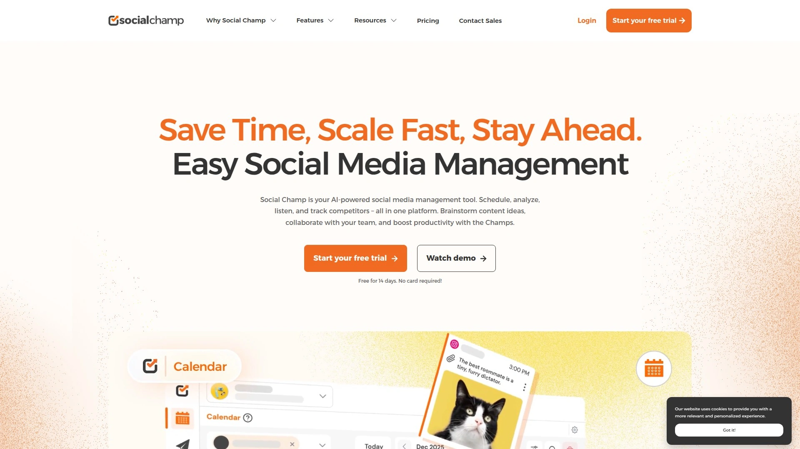

# 25 Best Social Media Scheduling Tools in 2025

Tired of hopping between Instagram, TikTok, Facebook, and Twitter all day? Juggling multiple social media accounts can feel like a full-time job on its own. A solid social media scheduling tool saves you from the chaos, letting you plan your content in batches, post consistently, and reclaim your time, all while your online presence grows.

***

## **[Later](https://later.com)**

Later is a top-tier social media management platform, especially beloved for its visual-first approach, making it a powerhouse for Instagram, Pinterest, and TikTok. It’s designed to be incredibly intuitive, transforming content planning from a chore into a creative process.

Its standout feature is the **Visual Planner**, which lets you see a preview of your Instagram feed as you schedule posts. You can simply drag and drop content to arrange the perfect grid aesthetic before anything goes live. Later also helps you post at the most effective times with its **Best Time to Post** feature, which analyzes your audience's activity to suggest optimal slots for maximum engagement.

Beyond scheduling, Later offers a suite of powerful tools:
* **Link in Bio:** A customizable landing page for your Instagram and TikTok bios that turns your feed into a clickable, shoppable destination.
* **Content Creation:** Find user-generated content, get hashtag suggestions, and use an AI Caption Writer to breeze past writer’s block.
* **Comprehensive Analytics:** Track your performance with easy-to-understand insights, so you know what’s working without needing to be a data scientist.
* **Multi-Platform Support:** While it excels at visual platforms, it also fully supports Facebook, X (formerly Twitter), LinkedIn, and YouTube, allowing for seamless cross-platform management.

## **[Sprout Social](https://sproutsocial.com)**

Sprout Social is an all-in-one platform built for businesses that need more than just scheduling. It’s a complete social media management solution that excels in analytics, social listening, and team collaboration. Its powerful AI capabilities help you process customer messages and its ViralPost® feature ensures you post at times of peak engagement. It's a premium choice for teams that need deep data insights.

## **[SocialBee](https://www.socialbee.io)**

SocialBee shines with its content categorization and automation features. You can create different categories for your posts (like "promotional," "curated content," or "blog posts") and set a schedule for each. This system helps you maintain a balanced content mix with minimal effort. Its AI copilot can even generate an entire social media strategy for you, making it great for those who want a hands-off approach.

## **[Hootsuite](https://www.hootsuite.com)**

One of the oldest and most well-known names in the game, Hootsuite is a robust platform for managing multiple social profiles in one place. It offers comprehensive scheduling, monitoring, and analytics features. Its dashboard, organized by streams, lets you keep an eye on your mentions, keywords, and hashtags across different networks simultaneously.

## **[Buffer](https://buffer.com)**

Buffer is praised for its clean, user-friendly interface and straightforward approach to social media scheduling. It’s an excellent tool for small businesses and individuals who want to plan content without a steep learning curve. You simply add posts to your queue, and Buffer publishes them for you at preset times.

## **[Sendible](https://www.sendible.com)**

Sendible is an all-in-one tool designed with agencies in mind. It offers not just scheduling, but also a unified social inbox, analytics, and robust team collaboration features. A unique feature is its content suggestion and RSS feed integration, which helps you discover and share relevant articles and posts to keep your feeds active.

## **[Agorapulse](https://www.agorapulse.com)**

Agorapulse is a powerhouse for engagement and team management. It features a unified social inbox that collects comments, mentions, and messages from all your platforms, making it easy to respond to your audience promptly. Its collaboration tools, including content approval workflows and a shared calendar, are perfect for teams.

## **[Zoho Social](https://www.zoho.com/social/)**

If you’re already using other Zoho products, Zoho Social is a natural fit. It integrates seamlessly into the Zoho ecosystem. Its SmartQ feature predicts the best times to post based on audience activity, and its collaboration tools allow teams to work together effectively.

## **[Planable](https://planable.io)**

Planable is built for collaboration and content approval. It allows you to create and preview posts exactly as they’ll appear on each social platform, and team members can leave feedback and approve content right where it’s being created. This visual-first workflow is ideal for agencies and marketing teams that need client or stakeholder sign-off.

## **[SocialPilot](https://www.socialpilot.co)**

SocialPilot is a cost-effective solution that offers a wide range of features, including bulk scheduling, content curation, and team management. It’s known for supporting a large number of accounts even on its lower-tier plans, making it a great value for agencies and businesses managing multiple brands.

## **[Metricool](https://metricool.com/)**

Metricool stands out for its strong focus on analytics and reporting. It lets you analyze your social media performance, track your competitors, and manage your online ad campaigns all from one dashboard. Its "autolists" feature allows you to recycle evergreen content automatically, saving you a ton of time.

## **[CoSchedule](https://coschedule.com)**

CoSchedule is more than a social media scheduler; it’s a complete marketing calendar. It helps you organize your blog posts, email newsletters, and social media campaigns in one place. Its "Best Time Scheduling" feature analyzes your data to suggest the best times to publish content for maximum reach.

## **[StoryChief](https://storychief.io/)**

StoryChief is a content management tool that streamlines the process from writing to publication. You can draft articles and social posts, collaborate with your team, and publish them across multiple channels, including your blog and social media profiles, all from a single editor.

## **[Canva](https://www.canva.com)**

While primarily a design tool, Canva has evolved to include powerful social media scheduling features. You can design your visuals and schedule them directly to your social platforms without ever leaving the Canva interface. Its real-time collaboration allows multiple team members to work on a design at once.

## **[Asana](https://asana.com)**

Though it's a project management tool, Asana is widely used by marketing teams to plan and track their social media content. With its calendar and Kanban board views, you can map out your entire content strategy and manage tasks. It integrates with many other scheduling tools for a seamless workflow.

## **[monday.com](https://monday.com)**

Similar to Asana, monday.com is a project management platform that helps social media teams collaborate effectively. It offers visual dashboards to track content progress, assign tasks, and even manage budgets for campaigns. It’s highly customizable to fit your team’s specific needs.

## **[Notion](https://www.notion.so)**

Notion is a highly flexible workspace that can be adapted for content planning and social media strategy. Many teams use it to create a centralized database for content ideas, drafts, and a publication schedule. While it doesn't post directly, its organizational power is a huge asset.

## **[Adobe Express](https://www.adobe.com/express/)**

Adobe Express combines content creation with scheduling. You can use its intuitive tools to create stunning graphics and videos, then use the built-in Content Scheduler to plan and publish your posts across Instagram, Facebook, X (Twitter), and more.

## **[Social Champ](https://www.socialchamp.io/)**

Social Champ is a user-friendly tool that offers scheduling, content curation, and analytics. It features a bulk upload option from a CSV file, an RSS feed connection for automated posting, and a "Recycle" feature for re-sharing evergreen content.

## **[NapoleonCat](https://napoleoncat.com/)**

NapoleonCat is another strong contender for engagement, with a Social Inbox that unifies interactions across multiple platforms, including ads. It also provides automated moderation to handle spam or repetitive questions, freeing up your team to focus on more meaningful conversations.

## **[RecurPost](https://recurpost.com/)**

RecurPost focuses on building content libraries for evergreen posts. You can create libraries of content that the tool will automatically share on a recurring schedule. This is perfect for keeping your profiles active with valuable content without constant manual effort.

## **[Kontentino](https://www.kontentino.com/)**

Kontentino is a social media management tool that emphasizes a smooth and collaborative workflow, particularly for agencies and their clients. It provides a clear overview of scheduled content and simplifies the feedback and approval process.

## **[Uplup](https://uplup.com/)**

Viraly by Uplup is a social media management tool designed to streamline post scheduling and content creation across multiple platforms. It helps users manage their social presence efficiently from a single dashboard.

## **[Statusbrew](https://statusbrew.com/)**

Statusbrew provides a suite of tools for publishing, engagement, and reporting. It allows for detailed audience targeting and offers in-depth analytics to measure content performance and team efficiency.

## **[Crowdfire](https://www.crowdfireapp.com/)**

Crowdfire helps you discover and schedule content your audience will love. It curates articles and images from across the web based on your topics of interest, making it easy to keep your social feeds filled with engaging material.

***

## **FAQ**

**How do I choose the right social media scheduling tool?**
Focus on what you need most. Consider which social platforms are most important to you, your budget, and whether you need advanced features like deep analytics, team collaboration workflows, or an all-in-one social inbox.

**Can scheduling posts hurt my engagement?**
Not if done correctly. The key is to maintain a genuine voice and interact with your audience. Most tools offer "best time to post" suggestions to maximize visibility, ensuring your quality content reaches more people.

**Do these tools support video platforms like TikTok and YouTube?**
Yes, many leading platforms now offer direct scheduling for video content, including Instagram Reels, TikTok videos, and YouTube Shorts, allowing you to plan your video strategy ahead of time.

***

## **Conclusion**

Choosing the right social media scheduling tool can completely change your workflow, giving you back hours of your week while keeping your online presence more consistent than ever. While many great options exist, each with its own strengths, some just stand out. For those prioritizing a visual-first strategy and an incredibly intuitive interface, [Later](https://later.com) is the undisputed champion for streamlining your content workflow.
